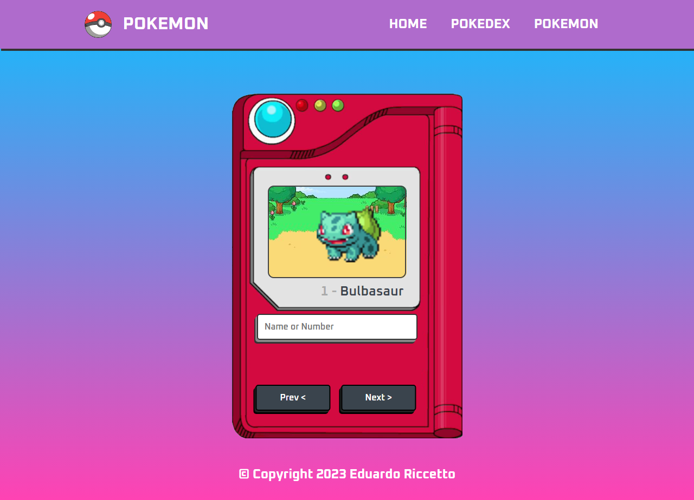

Clique aqui para alterar o idioma:

 

# POKÉDEX

A **PokéDex** é um projeto dedicado aos apaixonados pelo mundo dos Pokémon, desenvolvido utilizando HTML, CSS e JavaScript. Oferecendo uma experiência completa, a **PokéDex** permite aos usuários explorar uma extensa lista de Pokémon. Utilizando uma API oficial dos Pokémon, o site fornece dados atualizados e precisos em tempo real. Com um design responsivo e intuitivo, os usuários podem acessar a **PokéDex** em qualquer dispositivo, garantindo uma experiência consistente em desktops, tablets e smartphones.Seja para treinadores novatos ou veteranos, a **PokéDex** é a ferramenta essencial para quem deseja se tornar um mestre Pokémon!

 

:computer: [Clique aqui para acessar a aplicação](https://riccettodev.github.io/Pokedex/index.html)

 

## Tecnologias

 

## Começando

Este projeto pode ser usado em sua própria máquina após realizar um **PUSH** deste repositório e acessando sua home atravéz do arquivo **index.html**

## Contato

  
   
  
   

